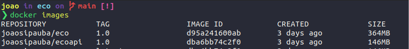
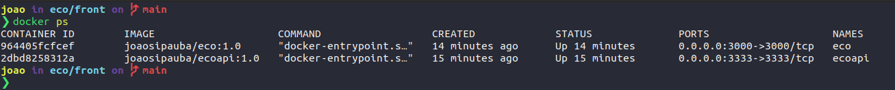

  
  
   
 

  

---

### O que é o ECO ❓

O nome **Eco** ♻ refere-se a uma "abreviação" de ecológico ou ecológica. O Eco é uma *"simples" aplicação web* desenvolvida com o intuito de facilitar a coleta de resíduos/produtos recicláveis na cidade de São Luís ❤, divulgando não só as empresas que trabalham 👔 nesse ramo como também, ajudando a encontrar os eco pontos 🗺 espalhados na cidade.

 

### 🚀 **Atualmente na aplicação da para fazer o que ❓**
✅ Visualizar os eco pontos ou empresas cadastradas na aplicação;

✅ Visualizar os dados como: nome, endereço, whatsapp ...

✅ Cadastrar uma eco ponto;

 

### 🚧 **Portas utilizadas**

Servidor 🌐 | Porta 🚪
---------:|:--------
web |  3000

 

### ⬇️ **Utilizando projeto localmente**

> ⚠ **Atenção**: Antes de seguir o passo a passo abaixo lembre-se de instalar o [node-js](https://nodejs.org/en/)

>No diretório desejado execute no terminal o comando abaixo 👇.

~~~bash
git clone https://github.com/AntonioNarcilio/eco.git
~~~

> Depois entre no diretório `eco`
~~~bash
cd eco
~~~

> Então basta executar o comando abaixo para instalar as dependências do projeto

~~~bash
npm install
~~~

> Com isso após ter finalizado a instalação de todas as dependências do projeto basta rodar o comando abaixo 👇 para iniciar a aplicação

~~~bash
npm start
~~~

---

> Pronto 🎊 a aplicação já esta funcionando, agora basta ir no navegador de sua preferência e digitar na barra de endereço
`localhost:3000` e pronto :).

 

### ⬇️ **Rodando o **Eco** com docker** 🐳

> ⚠ **Atenção**: Antes de seguir o passo a passo abaixo lembre-se de instalar o [docker](https://docs.docker.com)

> Para executar o projeto através de um container no docker é bem fácil basta executar o comando

~~~bash
docker pull antonionarcilio/eco:1.0
~~~

> Esse comando irá baixar uma image referente ao projeto armazenada em meu repositório. Para visualizar a image basta executar:

~~~bash
docker images
~~~
> Que ira aparecer algo como

> Com isso precisamos criar um container para rodar a aplicação, então execute:

~~~bash
docker run --name eco -p 3000:3000 -d antonionarcilio/eco:1.0 
~~~

> De forma bem direta esse comando irá criar um container chamado **eco** que rodará na porta 3000. Para vermos se ele realmente esta rodando basta executar o comando abaixo:

~~~bash
docker ps
~~~
> Que retorná algo como:

---

> Pronto 🎊 a aplicação já esta funcionando, agora basta ir no navegador de sua preferência e digitar na barra de endereço
`0.0.0.0:3000` e pronto :).

 

### 📜 Licença
Esse projeto está sob a licença MIT. Veja o arquivo [LICENSE](https://github.com/AntonioNarcilio/eco/blob/main/LICENSE) para mais detalhes.

 

---

Created by antonionarcilio 🤓